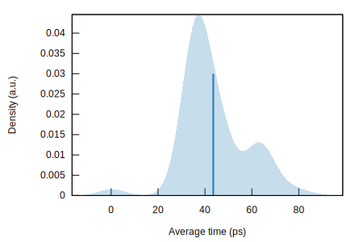
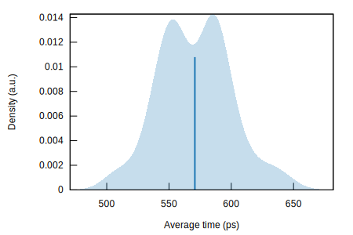
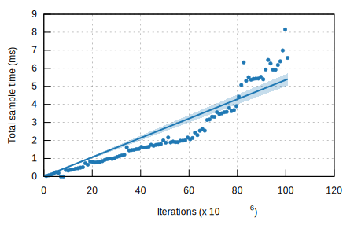
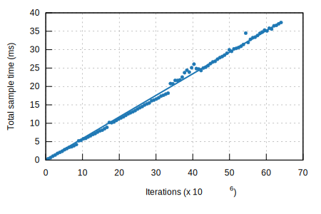

# overlay-map

**overlay-map** is a two-layered map data structure for Rust that tracks **current** and **previous** values for each key — with zero-clone, in-place state transitions.

It provides `OverlayMap<K, V>`, a map where each value is an `Overlay<V>`: a compact two-slot container that allows pushing, swapping, and pulling values without cloning or heap allocation.

> ⚠️ **Work in progress**: The library is still evolving.

## 📦 Features

- ✅ **In-place, zero-cost value updates**
- ✅ Foreground and background storage per key
- ✅ On `push`, the current foreground is moved to background
- ✅ No heap allocation or cloning for updates
- ✅ Conditional updates (`push_if`)
- ✅ Automatic removal when entries become empty
- ✅ `Overlay<T>` usable independently from the map

## 🧠 Core types

### `OverlayMap<K, V>`

A map-like wrapper for managing per-key two-layered state.

### `Overlay<T>`

A standalone container that tracks two versions of a value:
- `fg` → the current value
- `bg` → the previous value (optional)

Uses zero-copy, branchless slot flipping via raw memory and bitflags.

## 🚀 Example: Revolving Door of Values

```rust
use overlay_map::Overlay;

fn main() {
    let mut door = Overlay::new_fg("Alice");
    println!("Present: {:?}, {:?}", door.fg(), door.bg());

    for name in ["Bob", "Carol", "Dave", "Eve"] {
        if let Some(evicted) = door.swap(name) {
            println!("{evicted} left");
        }

        println!("Present: {:?}, {:?}", door.bg(), door.fg());
    }

    while let Some(pulled) = door.pull() {
        println!("{pulled} left");
    }

    println!("Present: {:?}, {:?}", door.bg(), door.fg());
}
```

## 🔬 Internal Design

- `Overlay<T>` uses `[MaybeUninit<T>; 2]` with a compact bitflag for presence and slot state.
- No heap allocation, no `Option<T>`, no clone required.
- Operations like `push`, `pull`, `swap` are in-place and branch-minimal.
- Designed for **high-throughput**, **zero-cost** data flow and state management.

## 🧠 Why use this?

`overlay-map` is ideal for:

- Managing *current vs previous* state without full history
- Speculative updates, rollback systems, or caching layers
- Config overlays, merging, and snapshotting
- Avoiding unnecessary cloning, allocation, and indirection in hot code paths

## 🧪 Performance: `Overlay<T>` vs `Option<(T, Option<T>)>`

These benchmarks measure the performance of the `push` operation in both the `Overlay<T>` and a conventional tuple-based implementation.

| Overlay Implementation | Tuple Implementation |
|------------------------|----------------------|
|  |  |
|  |  |

### 📊 Interpretation

- **Overlay**:
  - Operates near L1 cache speeds (sub-100ps per op).
  - Compact, branchless bitfield logic leads to extremely low overhead.
- **Tuple**:
  - Slower and more predictable due to enum tagging and control-flow overhead.
  - Useful baseline, but significantly outperformed by `Overlay`.

> These graphs were generated using [Criterion.rs](https://bheisler.github.io/criterion.rs/book/) and represent measured runtime distribution and scaling with iteration count.

## 📚 Documentation

- [Docs.rs](https://docs.rs/overlay-map)
- [Crates.io](https://crates.io/crates/overlay-map)

## 🔒 License

MIT

## ✨ Contributing

Contributions, bug reports, and feature ideas welcome.
